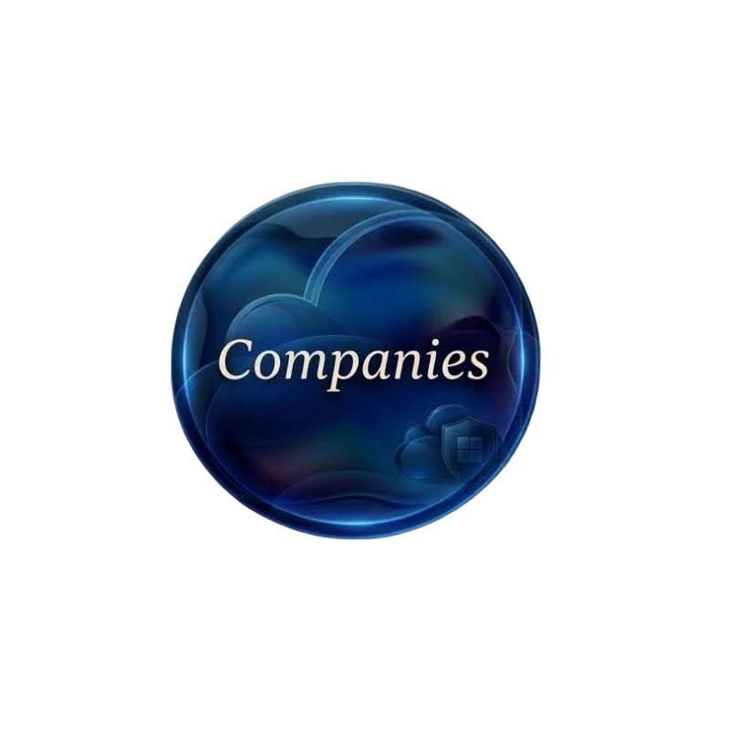

  
  
  

  

 

<h1 align="center">
  
  Registro de Clientes
</h1>

## Desarrollo Web

Implementación de soluciones digitales desarrolladas bajo criterios de calidad, escalabilidad y sostenibilidad, orientadas a atender necesidades específicas de organizaciones, empresas e iniciativas institucionales.

 
<table width="100%" align="center">
<tr>

<td width="75%" valign="top">

<table width="100%">
<thead>
<tr>
<th width="35%" align="left">Nombre Empresa</th>
<th width="30%" align="left">Tipo</th>
<th width="15%" align="center">Precio</th>
<th width="20%" align="center">Link</th>
</tr>
</thead>

<tbody>

<tr>
<td>Empresa 1</td>
<td>Sitio Web Corporativo</td>
<td align="center">$0</td>
<td align="center"><a href="#">Ver Proyecto</a></td>
</tr>

<tr>
<td>Empresa 2</td>
<td>Landing Page</td>
<td align="center">$0</td>
<td align="center"><a href="#">Ver Proyecto</a></td>
</tr>

<tr>
<td>Empresa 3</td>
<td>E-Commerce</td>
<td align="center">$0</td>
<td align="center"><a href="#">Ver Proyecto</a></td>
</tr>

<tr>
<td>Empresa 4</td>
<td>Portal Web</td>
<td align="center">$0</td>
<td align="center"><a href="#">Ver Proyecto</a></td>
</tr>

</tbody>
</table>

</td>

<td width="25%" align="center" valign="middle">

</td>

</tr>
</table>

 

---
## Administración de Entornos Microsoft Azure

Gestión y administración de recursos tecnológicos desplegados en Microsoft Azure, bajo criterios de control operativo, seguridad, trazabilidad y cumplimiento de lineamientos establecidos por cada organización.
<table width="100%" align="center">
<tr>

<td width="75%" valign="top">

<table width="100%">
<thead>
<tr>
<th width="35%" align="left">Nombre Empresa</th>
<th width="30%" align="left">Tipo</th>
<th width="15%" align="center">Precio</th>
<th width="20%" align="center">Link</th>
</tr>
</thead>

<tbody>

<tr>
<td>Empresa 1</td>
<td>Sitio Web Corporativo</td>
<td align="center">$0</td>
<td align="center"><a href="#">Ver Proyecto</a></td>
</tr>

<tr>
<td>Empresa 2</td>
<td>Landing Page</td>
<td align="center">$0</td>
<td align="center"><a href="#">Ver Proyecto</a></td>
</tr>

<tr>
<td>Empresa 3</td>
<td>E-Commerce</td>
<td align="center">$0</td>
<td align="center"><a href="#">Ver Proyecto</a></td>
</tr>

<tr>
<td>Empresa 4</td>
<td>Portal Web</td>
<td align="center">$0</td>
<td align="center"><a href="#">Ver Proyecto</a></td>
</tr>

</tbody>
</table>

</td>

<td width="25%" align="center" valign="middle">

</td>

</tr>
</table>

---

## Sistemas para Empresas bajo Contrato

Soluciones tecnológicas desarrolladas y mantenidas en el marco de acuerdos contractuales formales, con participación de responsables designados por la organización, definición explícita de funciones y seguimiento conforme a los lineamientos establecidos para cada proyecto.

 
<table width="100%" align="center">
<tr>

<td width="75%" valign="top">

<table width="100%">
<thead>
<tr>
<th width="35%" align="left">Nombre Empresa</th>
<th width="30%" align="left">Tipo</th>
<th width="15%" align="center">Precio</th>
<th width="20%" align="center">Link</th>
</tr>
</thead>

<tbody>

<tr>
<td>Empresa 1</td>
<td>Sitio Web Corporativo</td>
<td align="center">$0</td>
<td align="center"><a href="#">Ver Proyecto</a></td>
</tr>

<tr>
<td>Empresa 2</td>
<td>Landing Page</td>
<td align="center">$0</td>
<td align="center"><a href="#">Ver Proyecto</a></td>
</tr>

<tr>
<td>Empresa 3</td>
<td>E-Commerce</td>
<td align="center">$0</td>
<td align="center"><a href="#">Ver Proyecto</a></td>
</tr>

<tr>
<td>Empresa 4</td>
<td>Portal Web</td>
<td align="center">$0</td>
<td align="center"><a href="#">Ver Proyecto</a></td>
</tr>

</tbody>
</table>

</td>

<td width="25%" align="center" valign="middle">

</td>

</tr>
</table>
 

---

## Socios

Red de aliados estratégicos que participan en iniciativas específicas, aportando experiencia, capacidades complementarias y acompañamiento profesional en la ejecución de proyectos.

 
<table width="100%" align="center">
<tr>

<td width="75%" valign="top">

<table width="100%">
<thead>
<tr>
<th width="35%" align="left">Nombre Empresa</th>
<th width="30%" align="left">Tipo</th>
<th width="15%" align="center">Precio</th>
<th width="20%" align="center">Link</th>
</tr>
</thead>

<tbody>

<tr>
<td>Empresa 1</td>
<td>Sitio Web Corporativo</td>
<td align="center">$0</td>
<td align="center"><a href="#">Ver Proyecto</a></td>
</tr>

<tr>
<td>Empresa 2</td>
<td>Landing Page</td>
<td align="center">$0</td>
<td align="center"><a href="#">Ver Proyecto</a></td>
</tr>

<tr>
<td>Empresa 3</td>
<td>E-Commerce</td>
<td align="center">$0</td>
<td align="center"><a href="#">Ver Proyecto</a></td>
</tr>

<tr>
<td>Empresa 4</td>
<td>Portal Web</td>
<td align="center">$0</td>
<td align="center"><a href="#">Ver Proyecto</a></td>
</tr>

</tbody>
</table>

</td>

<td width="25%" align="center" valign="middle">

</td>

</tr>
</table>

 

---

## © Trazabilidad Documental, Resguardo de Evidencias y Cumplimiento Normativo

La autora mantiene una política de registro, conservación de evidencias y trazabilidad documental respecto de situaciones que puedan afectar su actividad profesional, su identidad digital, la integridad de sus proyectos, la correcta atribución de los trabajos aquí documentados o el normal desarrollo de sus actividades académicas y laborales.

Con el objeto de garantizar la adecuada protección de la información, la identidad profesional y los activos documentales asociados a este repositorio, toda incidencia relevante podrá ser registrada, preservada y archivada junto con los antecedentes, evidencias y elementos de contexto que resulten pertinentes para su adecuada evaluación.

Este repositorio se desarrolla bajo principios de respeto profesional, integridad académica, correcta atribución de autoría y utilización responsable de la información. En consecuencia, no se considera aceptable la reproducción no autorizada de contenidos, la apropiación de materiales, la suplantación de identidad profesional, el seguimiento persistente de actividades digitales, los intentos de contacto no solicitados o cualquier otra conducta que exceda los límites habituales de interacción dentro de entornos académicos, tecnológicos o profesionales.

En aquellos casos que así lo justifiquen, la información recopilada podrá ser remitida mediante los canales formales correspondientes a autoridades administrativas, organismos de seguridad, dependencias policiales, organismos especializados en delitos informáticos, asesores legales o instituciones competentes, exclusivamente con fines de verificación, resguardo documental, protección de derechos y tratamiento adecuado de los hechos conforme al marco normativo aplicable.

La existencia de registros, evidencias y mecanismos de trazabilidad asociados a este repositorio responde a criterios de integridad documental, responsabilidad profesional, protección de la autoría y adecuada gestión de la información, constituyendo parte de las medidas adoptadas para preservar la autenticidad, legitimidad y correcta atribución de los contenidos aquí publicados.

Todos los derechos reservados.

---

**Ultima Actualización: 30 / 07 / 2026**

